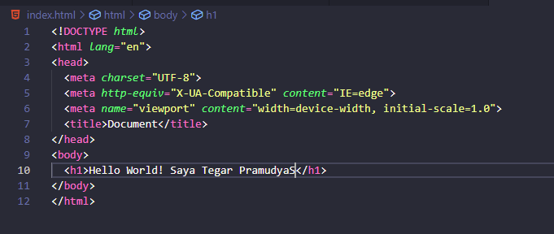

# HTML
**HTML (HyperText Markup Language)** adalah suatu bahasa yang menggunakan tanda-tanda tertentu (tag) untuk menyatakan kode-kode yang harus ditafsirkan oleh browser agar halaman tersebut dapat ditampilkan secara benar.

- **Kerangka HTML** 
Disetiap tag didalam program HTML selalu ada pembuka dan penutup. Contohnya tag `<head>` akan ditutup dengan tag `</head>`. Sintak diatas biasa disebut dengan kerangka bahasa pemrograman HTML. Didalam website selalu ada title untuk tiap-tiap web, untuk memasukkan title didalam web kamu harus mengetikkan diantara tag `<tittle>` ... `</tittle>` (titik-titik itu dapat diisikan dengan nama website kamu atau yang lainnya).

Untuk memasukkan konten-konten, kamu dapat memasukkannya atau mengetikkannya didalam program tepat diantara tag `<body>` ... `</body>` (Ganti titik-titik dengan konten) 
 
- **Contoh tag HTML** 
  - **Tag untuk membuat tulisan dengan link**  
   
  Hasil output di browser 
   

  - **Tag untuk mengubah tulisan menjadi Tebal dan Miring** 
   
  Hasil output di browser 
   

  - **Tag untuk membuat Ordered list** 
   
  Hasil output di browser 
   

  - **Tag untuk membuat Unordered list** 
   
  Hasil output di browser 
   

  - **Tag HTML untuk menambahkan gambar** 
   
  Hasil output di browser 
   

- **Deployment** 
Deploy adalah sebuah proses untuk menyebarkan aplikasi yang sudah kita kerjakan supaya bisa digunakan orang lain, untuk melakukan deploy kita bisa menggunakan website netlify.
