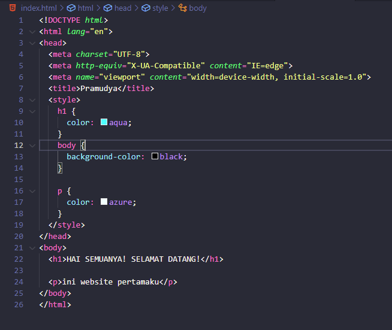
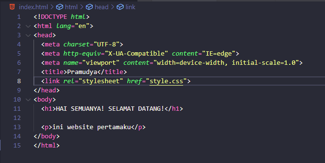
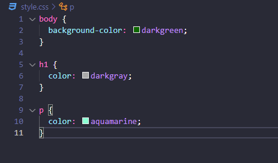

# CSS

CSS adalah salah satu styling language (bahasa desain), bagian dari markup language yang dapat “mewarnai” atau mendesain suatu halaman website. CSS sendiri adalah singkatan dari Cascading Style Sheet. Markup language ini biasanya dipasangkan dengan markup language (bahasa marka) seperti HTML.

- Cara menysipkan CSS kedalam HTML 
Ada 3 cara yaitu :

  - **Inline css** 
  Anda dapat langsung memasukan CSS pada atribut HTML 
   
  Hasil Output inline css 
   

  - **Internal** 
  Kita Menggunakan tag `<style>` didalam tag `<head>` 
  
  Hasil Output di browser 
   
  
  - **Eksternal** 
  Kita menyisipkan kedalam html dengan file terpisah, lalu memanggil nya didalam file html seperti dibawah ini 
  
    File HTML 
     

    File Eksternal CSS 
     

    Hasil Output di browser 
    
    

