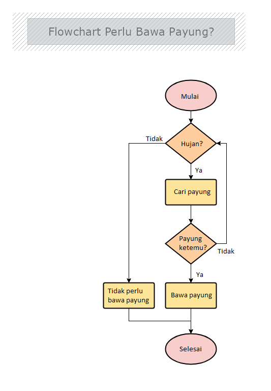
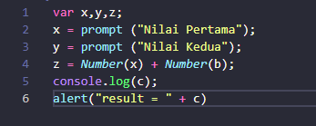
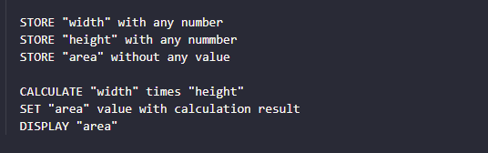

# Algoritma & Struktur Data

**Algoritma** adalah suatu upaya dengan urutan operasi yang disusun secara logis dan sistematis untuk menyelesaikan suatu masalah untuk menghasilkan suatu output tertentu.

**Struktur data** adalah cara penyimpanan , pengorganisasian , dan pengaturan data di dalam media penyimpanan komputer sehingga data tersebut dapat digunakan secara efisien.

- **Manfaat Algoritma & Struktur Data** 
 Agar bisa mempermudah membuat program yang dapat menyelesaikan masalah tertentu. Bisa digunakan berulang kali dalam menyelesaikan suatu permasalahan. Membantu menyelesaikan suatu masalah dengan logika dan juga sistematis. Agar bisa meminimalisir penulisan program secara berulang-ulang.

 - **Contoh Algoritma dikehidupan sehari-hari** 
 1. Apakah hujan?
 2. Jika tidak hujan, kamu tidak perlu bawa payung
 3. Jika hujan, segera cari payung
 4. Ketika payung sudah ketemu, bawa payungnya
 5. Jika payung tidak ketemu pastikan apakah masih hujan dan akan kembali berputar ke poin 2 dan 3.
 

 - P**enggunaan Algoritma dengan javascript** 
 Berikut ini merupakan contoh penggunaan algoritma pada javascript.
 

- **Pengertian Pseudocode** 
Pseudocode atau kode semu dapat diartikan sebagai deskripsi dari algoritma pemrograman yang dituliskan secara sederhana dibandingkan dengan sintaksis bahasa pemrograman. Tujuannya, agar lebih mudah dibaca dan dipahami manusia.

  - **Panduan menuliskan Pseudocode** 
    1. Menggunakan HURUF BESAR(KAPITAL) pada kata kunci (key command)
    2. 1 statement = 1 baris
    3. Gunakan indentasi
    4. Penulisan yang simple

- **Beberapa Pseudocode berdasarkan kondisi masalah** 
  - **Procedural** 
  Cara berfikir yang beruntun atau serangkaian perintah yang beruntun
  - **Conditional** 
  Digunakan saat dibutuhkan percabangan kasus, komputer akan melakukan percabangan jika suatu kondisi sudah terpenuhi. 

      
  - **Looping** 
  Komputer dapat melakukan sebuah proses yang sama berulang-ulang. Jika membutuhkan perulangan dalam kasus tertentu, kita bisa menggunakan Looping. 
  - **Recursive** 
  Recursive adalah pola pikir dalam algoritma yang memanggil method/function didalam sebuah function.