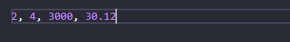
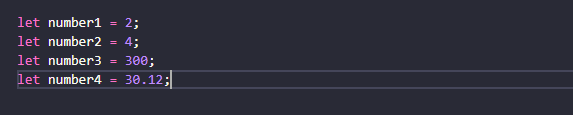
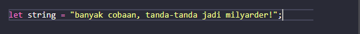
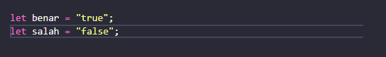
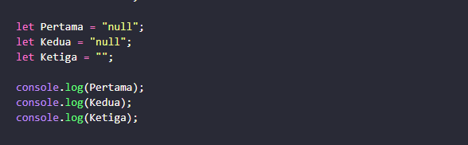
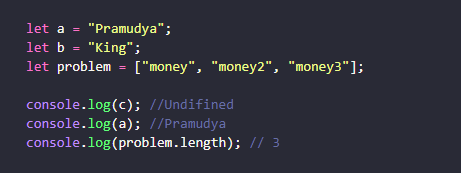
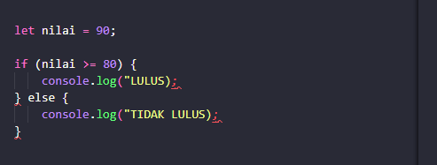
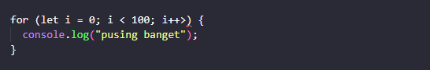

# JavaScript Dasar
**JavaScript** adalah bahasa pemrograman tingkat tinggi dan dinamis. JavaScript populer di internet dan dapat bekerja di sebagian besar penjelajah web populer seperti Google Chrome, Internet Explorer, Mozilla Firefox, Netscape dan Opera. Kode JavaScript dapat disisipkan dalam halaman web menggunakan tag script. 

- **Tipe data** 
Klasifikasi yang digunakan pada programming yaitu tipe data, ada 6 tipe data fundamental pada javascript, yaitu: 
  - Number
  - String
  - Boolean
  - Null
  - Undifined
  - Object

- **Tipe Data Number** 
  Tipe data number adalah tipe data yang mengandung semua angka termasuk angka desimal. 

   
   

- **Tipe Data String** 
Tipe data string adalah grup karakter yang ada pada keyboard laptop/PC kita yaitu letters (huruf), number (angka), spaces (spasi), symbol, dan lainnya. 
  
    

- **Tipe Data Boolean** 
Tipe data boolean adalah tipe data yang hanya mempunyai 2 buah nilai. 2 buah nilai tersebut adalah TRUE (benar) or FALSE (salah). Analoginya adalah seperti tombol/button ON/OFF dan juga seperti sebuah jawaban antara YES/NO. 

   
  
- **Tipe Data Null** 
Tipe data null adalah tipe data yang diartikan bahwa sebuah variable/data tidak memiliki nilai. Null berbeda dengan string kosong. String kosong masih memiliki tipe data string. 

   

- **Tipe Data Undifined** 
Tipe data undefined adalah tipe data yang merepresentasikan varibel/data yang tidak memiliki nilai. Undefined berbeda dengan null. 

  

- **Tipe Data Object** 
Tipe data object adalah koleksi data yang saling berhubungan (related). Tipe data pbject dapat menyimpan data dengan tipe data apapun (number, string, boolean, dan lainnya). Tipe data object mempunyai key dan value.  

- **Variabel** 
Variable adalah container/tempat untuk menyimpan sebuah nilai. Terdapat 3 cara dalam mendefinisikan sebuah variabel, yaitu dengan menggunakan let, var, dan const. 

- **Operator** 
Operator adalah simbol atau karakter khusus yang digunakan untuk melakukan suatu operasi untuk memanipulasi secara matematis atau logis pada data yang diberikan. 

- **Conditional Looping** 
**Conditional** merupakan statement percabangan yang menggambarkan suatu kondisi. Conditional statement akan mengecek kondisi spesifik dan menjalankan perintah berdasarkan kondisi tersebut. Yang dicek adalah apakah kondisi tersebut TRUE (benar). Jika TRUE maka code didalam kondisi tersebut dijalankan. 

   

  **Looping** 
   adalah statement yang mengulang sebuah instruksi hingga kondisi terpenuhi atau jika kondisi stop/berhenti tercapai.  

  